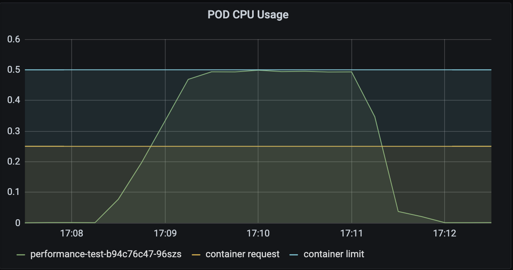
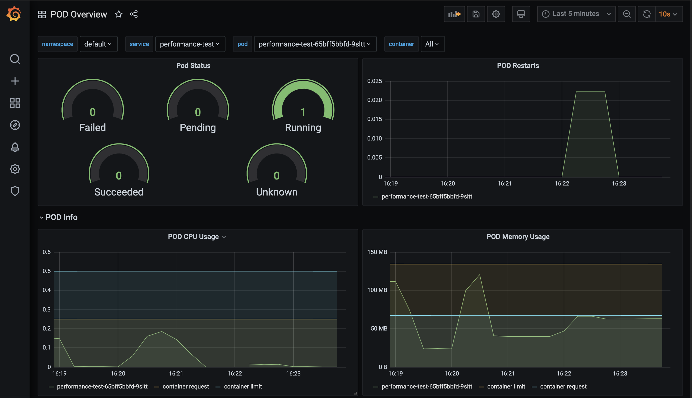

# Grafana

## Install Grafana
```
helm repo add grafana https://grafana.github.io/helm-charts

helm install my-grafana-release -n=monitoring grafana/grafana
```

## Delete Grafana
```
helm delete -n=monitoring my-grafana-release
```

click on this [link](http://localhost:3000) to navigate to grafana page after
running the below command
```
kubectl port-forward service/my-grafana-release --namespace=monitoring 3000:80
```

## Login credentials for grafana

### username
```sh
kubectl get secret --namespace monitoring my-grafana-release -o jsonpath="{.data.admin-user}" | base64 --decode ; echo
```
### password
```sh
kubectl get secret --namespace monitoring my-grafana-release -o jsonpath="{.data.admin-password}" | base64 --decode ; echo
```
## Add prometheus as data source to grafana
[reference](https://community.grafana.com/t/grafana-http-error-bad-gateway-and-templating-init-failed-errors/4925)

* Click on add data source
* Select prometheus
* Use prometheus server service IP in the http url instead of port forwarded IP.

  you can get the prometheus server service IP through below command
  ```sh
  kubectl get services --namespace=monitoring | grep my-prometheus-release-server
  ```
* Click on Save & Test.

## Some useful Grafana Dashboards for better insights

* Kubernetes cluster monitoring (via Prometheus) - 315
* K8 Cluster Detail Dashboard - 10856

## Load Pod Overview Custom dashboard

* Select [import](http://localhost:3000/dashboard/import) in the grafana
* Copy paste the grafana-dashboard.json file content in Import via panel json
* Click on load
* Click on import

## Preview CPU throttling
Run the below command for two times
```apache benchmark
ab -c 20 -k -n 100 http://localhost:8000/cpuSpike/100
```



You can observe that the pod's cpu utlization reaches the container limit but it will not exceed the CPU limit.

However, a POD will not be killed for excessive CPU usage but all the requested handled by the POD will get delayed due to throttling of the CPU. [FYI](https://kubernetes.io/docs/concepts/configuration/manage-resources-containers/)

 
## Preview OOM restart
Run the below command for two times
```apache benchmark
 ab -c 5 -k -n 100 http://localhost:8000/memorySpike/100
```
and you can observe the restart of the POD as per the below image



but in the image you can also observe that the pod memory doesn't exceed the POD limit.

This is may be due to the 15 sec scrape interval of the prometheus.

We can avoid this and can get a more real time metrics by decreasing the scrape interval which is an overkill for the local minikube environment.

## Observations

* Initially while testing the OOM restart, I have observed that the POD is getting restarted even before it reaches the memory limit beacuse of the readiness probe that I have added initially for the performance-test deployment.
